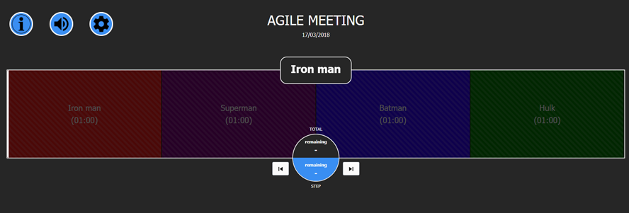

# AGILE TIME KEEPER (ATK)

This project permits to display a time keeper companion that help you track time sequence in a meeting.



## Serve the pages

### Basic user mode

The ATK project is deployed on the Docker Hub. To install you can :

* First get [docker](https://docs.docker.com/install) :

And use plain-old Docker command

```bash
docker run -d -p 4200:80 --name atk zolenas/atk
```

* Or with [docker-compose](https://docs.docker.com/compose/install) (you will have to get the docker-compose.yml file first) :

```bash
docker-compose up -d
```

(this command must be launched at the docker-compose.yml file level)

### Developer mode

You have to serve the page and see your modifications using an HTTP Server.

* With [node.js](https://www.npmjs.com/package/http-server) (You must get node.js first):

```bash
http-server -p 4200
```

* With [python 2](https://docs.python.org/2/library/simplehttpserver.html):

```bash
python -m SimpleHTTPServer 4200
```

* With [python 3](https://docs.python.org/2/library/simplehttpserver.html):

```bash
python -m http.server 4200
```

and go on [localhost:4200](http://localhost:4200)

## Configuration

1/ You can set your timer default template by modifying the `/meetings/data.json` file.
2/ You are also able to set it dynmically with the settings view (click on settings icon to open it).

### Set the title of your meeting

modify the "title" property.

```json
"title": "My title"
```

### Add a sequence

Add an object in the sequences array.
A sequence must contains three properties (title, duration and color).

```json
"sequences": [
    {
        "title": "Introduction",
        "duration": 1,
        "color": "red",
        "extra": "my introduction extra content"
    }
]
```

### Note

* 1 = a minute
* 0.1 = 6 sec
* colors available = blue, red, yellow, purple, green
* extra = optional

## Demo

You can find the ATK demo [here](https://zolenas.github.io/agile-time-keeper/)

## Next steps

* Mobile adaptation (PWA and/or Cordova)
* Save on default template

## Authors

### Development Lead

* [**Frédéric Faure**](mailto:frederik.faure@gmail.com)

### Co-Author

* [**Nicolas Rouvière**](mailto:zesk06@gmail.com)

## License

This project is under MIT license - see the [LICENSE](LICENSE.md) file for details.
